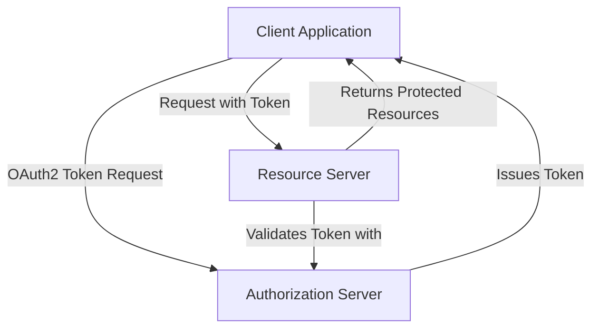

# OAuth2 com Spring Boot 3.3+ 

Uma implementação OAuth2 robusta usando Spring Boot 3.3+. Este projeto demonstra uma configuração completa do OAuth2 com um servidor de autorização, servidor de recursos e aplicativos cliente.

Em particular, este aplicativo está exibindo o novo suporte RestClient para OAuth2 no Spring Security 6.4.

https://spring.io/blog/2024/10/28/restclient-support-for-oauth2-in-spring-security-6-4

## Project Overview

The project consists of three main components:

1. **Authorization Server** (Port 9000) - Handles authentication and issues OAuth2 tokens
2. **Resource Server** (Port 8082) - Provides protected golf lesson endpoints
3. **Client Applications**:
    - OAuth2 Client (Spring Security implementation)
    - No-Auth Client (RestClient without Authorization)

## Architecture



## Project Requirements

- Java 23
- Spring Boot 3.3.5+
- Maven 3.6+
- Spring Security 6.4+

## Key Features

- OAuth2 Authorization Server implementation
- JWT token-based authentication
- Resource server with protected endpoints
- Client credential flow implementation
- RestClient with OAuth2 support

## Getting Started

### Setting Up the Authorization Server

1. Start the authorization server:

```bash
cd authorization-server
./mvnw spring-boot:run
```

The server will start on port 9000 with the following configuration:

```yaml
spring:
  security:
    oauth2:
      authorizationserver:
        issuer: http://localhost:9000
```

### Setting Up the Resource Server

1. Start the resource server:

```bash
cd resource-server
./mvnw spring-boot:run
```

The resource server runs on port 8082 and is configured to validate tokens with the authorization server:

```yaml
spring:
  security:
    oauth2:
      resourceserver:
        jwt:
          issuer-uri: http://localhost:9000
```

### Client Applications

#### OAuth2 Client Application

Configuration example:

```yaml
spring:
  security:
    oauth2:
      client:
        registration:
          golf-client:
            client-id: golf-client
            client-secret: golf-secret
            authorization-grant-type: client_credentials
            scope: read
```

#### Using the REST API

To access protected resources:

```java
@RestController
public class LessonsController {
    private final RestClient restClient;

    @GetMapping("/lessons")
    public String fetchLessons() {
        return restClient.get()
                .uri("http://localhost:8082/lessons")
                .attributes(clientRegistrationId("golf-client"))
                .retrieve()
                .body(String.class);
    }
}
```

## Security Configuration

### Authorization Server

The authorization server is configured with in-memory client registration:

```java
@Bean
public RegisteredClientRepository registeredClientRepository() {
    RegisteredClient registeredClient = RegisteredClient.withId(UUID.randomUUID().toString())
            .clientId("golf-client")
            .clientSecret(passwordEncoder().encode("golf-secret"))
            .clientAuthenticationMethod(ClientAuthenticationMethod.CLIENT_SECRET_BASIC)
            .authorizationGrantType(AuthorizationGrantType.CLIENT_CREDENTIALS)
            .scope("read")
            .build();
    return new InMemoryRegisteredClientRepository(registeredClient);
}
```

### Resource Server

The resource server is configured to require authentication for all requests:

```java
@Configuration
@EnableWebSecurity
public class ResourceServerConfig {
    @Bean
    public SecurityFilterChain securityFilterChain(HttpSecurity http) throws Exception {
        http
            .authorizeHttpRequests(authorize -> authorize
                .anyRequest().authenticated()
            )
            .oauth2ResourceServer(oauth2 -> oauth2
                .jwt(Customizer.withDefaults())
            );
        return http.build();
    }
}
```

## API Endpoints

### Lessons API

`GET /lessons` - Retrieves available golf lessons

Example response:
```json
[
  {
    "title": "Beginner Golf Basics",
    "description": "An introduction to the fundamentals of golf.",
    "instructor": "John Doe",
    "schedule": "2024-11-05T10:00:00"
  }
]
```

## Testing

The project includes JUnit tests for each component. Run tests using:

```bash
mvn test
```

## Error Handling

The client applications include comprehensive error handling for OAuth2-related issues:

```java
.defaultStatusHandler(HttpStatusCode::is4xxClientError, (request, response) -> {
    if (response.getStatusCode() == HttpStatus.UNAUTHORIZED) {
        throw new ResponseStatusException(HttpStatus.UNAUTHORIZED, 
            "Unauthorized access to lessons API");
    }
    throw new ResponseStatusException(response.getStatusCode(), 
        "Client error occurred");
})
```
## Youtube Video tutorial

https://www.youtube.com/watch?v=nFKcJDpUuZ8

## Repo Github

https://github.com/danvega/golf-scheduler?tab=readme-ov-file